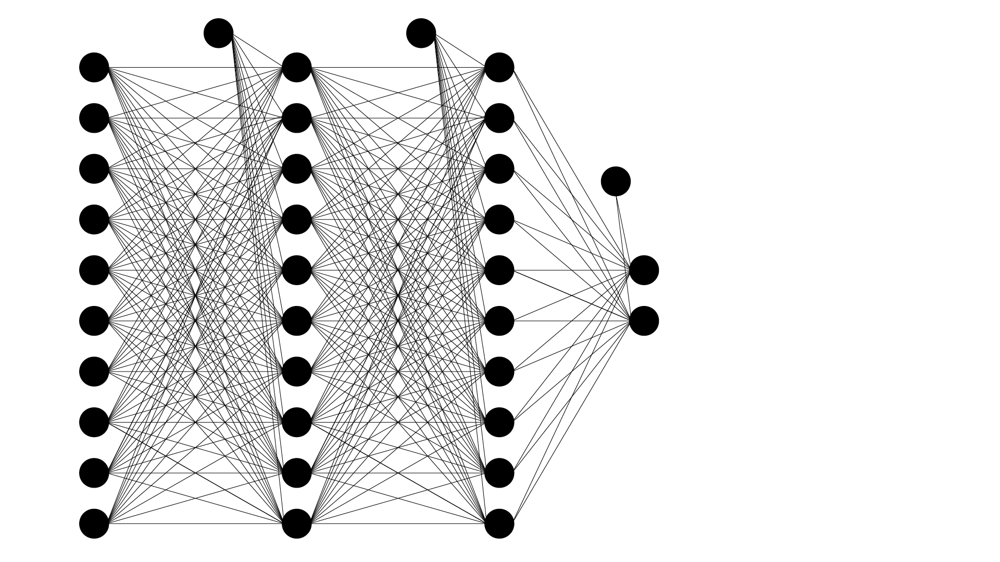

```{r setup, include=FALSE}
knitr::opts_chunk$set(echo = TRUE)
setwd(getwd())
```

```{r}
suppressMessages(library(readr))
suppressMessages(library(keras))
suppressMessages(library(DT))
```

<style type="text/css">
h1 {
    color:#1a2451;
}
h2 {
    color:#ffbd4a;
}
h3 {
    color:#1a2451;
}
</style>


## Introduction

This chapter introduces a densely connected deep neural network with two hidden layers and an output layer.  It serves as a first example of the concepts that follow directly from the preceding chapter.

A densely connected network is the simplest form of a network.  Each of the nodes in each of the hidden  and the output layers are connected to each of the nodes in the layers before it in the algorithm.

New concepts are introduced as well.  The first considers _one-hot-encoding_ of the binary target variable.  There is also a new activation function, _softmax_, which will be demonstrated here, but described in more detail in a following chapter.

One of the most important concepts in machine learning is also shown in this demonstration.  It pertains to splitting the data into two sets.  The first is a _training set_.  This is the data that will be passed to the neural network.  The second is the _test set_.  This data is kept from the network.  Once the network has learned from the training data, it can be tested against the _unseen_ data in the test set so as to determine how well the _learning_ performed.

## Data

With the working directory (folder) set to the directory in which this markdown file is saved, the `read_csv()` function is used below to import a `.csv` file, which resides in the same directory (therefor negating the need to type the full address of the file).

The file consists of $50000$ observations with $10$ feature variables and a binary target variable.

The `read_cvs()` function is part of the `readr` package that was imported above.  It has subtle differences from the standard `read.csv()` function.  It creates a _tibble_ which is different from a standard `data.frame`, the latter resulting from importing using `read.csv()`.  A tibble displays large datasets better than a data.frame.  It also never uses row names and does not store variables as special attributes.

The code below reads the `.csv` file and the displays a random $1$% of it in a table using the `DT` package.  This display is intended for output to a web page.  It uses the `datatable()` function.  The `data.set` object is passed as argument with square bracket denoting a `row,column` address.  The rows are selected at random using the `sample()` function.  The first argument of this function state the total number of rows of the full dataset.  The second states explicitly not to replace rows once they have been selected.  The last argument show the size, which is `0.01` of the total number of rows.  Note the closing parenthesis, `)` and the a comma.  There is only a space after the comma, which is shorthand for indicating all the columns.

```{r}
data.set <- read_csv("SimulatedBinaryClassificationDataset.csv",
                 col_names = TRUE)
datatable(data.set[sample(nrow(data.set),
                          replace = FALSE,
                          size = 0.01 * nrow(data.set)), ])
```

The `summary()` function provides descriptive statistics for each of the variables.

```{r}
summary(data.set)
```


## Preparing the data (preprocessing)

The data structure that exists after importing must be prepared before it can be passed to a neural network.  Several steps are involved in this preparation and are given below.

### Transformation into a matrix

The data structure is transformed into a _mathematical_ matrix using the `as_matrix()` function before removing the variable (column) names.

```{r}
# Cast dataframe as a matrix
data.set <- as.matrix(data.set)

# Remove column names
dimnames(data.set) = NULL
```

### Train and test split

The dataset, which now exists as a matrix, must be split into a training and a test set as mentioned in the introduction.  There are various ways in `R` to perform this split.  Once such method is shown below.

The `set.seed()` function, with its arbitrary argument `123`, ensures that the random _splitting numbers_ generated to split the data will follow a pattern that is repeated when the code is re-executed later or by others.  This simply ensures reprodicibility for the sake of this text.

The code creates an object named `indx`. The`sample()` function creates a random sample.  The first argument, `2`, is a list item.  The count starts at $1$ and goes up in steps of $1$.  The sample will thus be selected from the sample space of only two elements, $\left\{1,2\right\}$.

The next argument stipulates how many samples are required for the `indx` object.  In this instance, it is set to the number of rows in the dataset, thereby ensuring that there is a number, either $1$ or $2$, for each row.

The `replace = TRUE` argument stipulates that the elements $\left\{1,2\right\}$ are replaced after each round of randomly selecting a $1$ or a $2$, thereby ensuring a random sample of more than just two elements.

The `prob = c()` argument gives the probability that each respective element in the sample space has of being selected during each round.

```{r}
# Split for train and test data
set.seed(123)
indx <- sample(2,
               nrow(data.set),
               replace = TRUE,
               prob = c(0.9, 0.1)) # Makes index with values 1 and 2
```

The probability of a $1$ being selected is set at $90$% and of a $2$ being selected is set at only $10$%.  Note that these values must sum to $100$%.  These numbers, $1$ and $2$ are going to added to each row and thereby allow for the split along these two values.  The split will therefor create a sub-dataset that contains $90$% of the original dataset and another that will contain the remaining $10$.  This is a choice that the designer of the neural network must make.

The first sub-dataset is ultimately going to be the training set that is passed to the network from which it will learn the optimum parameters (so as to minimize the cost function).  The second will be the test set against which the learned parameters will be tested.  Generally, the larger the original dataset, the smaller the second set can be.  There are two forces at play.  The training set must be as large as possible to maximize the learning phase.  The test set, though, must be big enough to be representative of the data as a whole.  This ensures generalization to real-world data for which each network is ultimately designed.

In a tiny dataset containing only $200$ samples, a $10$% test set contains only $20$ samples, which might not be representative.  In the case of the dataset used in this chapter, $10$% comprises a massive $5000$ samples (roughly, as the precise number of $2$<sup>s</sup> are random).  This still leaving $45000$ for training.   The approximate $5000$ samples should be quite enough to be representative for testing, whilst the $45000$ should be enough to maximize learning.

The code below is very compact, but achieves a lot.  It creates two objects named `x_train` and `x_test`.  It is customary to use an `x` when referring to the matrix of feature variables.  The `_train` and `_test` post-fixes differentiates the two objects for their ultimate roles.

The square bracket notation references addressing.  Each value in a matrix has an address, given by its row number and then its column number, separated by a comma.  The code then takes the list of randomly created $1$ and $2$ values from the `indx` object and selects those where the `indx` object has a value of `1` (by row) to go into the `x_train` object.  The columns are `1:10` specifying shorthand for columns $1$ through $10$, i.e. only the $10$ feature variables.

```{r}
# Select only the feature variables
# Take rows with index = 1
x_train <- data.set[indx == 1, 1:10]
x_test <- data.set[indx == 2, 1:10]
```

### Processing the target variable

The target variable must be split in a similar way.  A separate object, `y_test_actual`, is created to hold the ground-truth (actual) feature values of the test set for later use.  Note the use of indexing (row, column), indicating that these belong to the test set and that only the last column, `11` (the target) is included.

```{r}
y_test_actual <- data.set[indx == 2, 11]
```

This chapter will use the `softmax` activation function in the output (see below).  This requires the target variable to be _one-hot-encoded_ .  The concept is quite simple.  Since there are only two elements in the sample set of the target variable in this example, $0$ and $1$, two variables are created by one-hot-encoding.  The names for these variable are natural numbers starting at $0$.  Consider a target variable that was not either a $0$ or a $1$, i.e. _benign_ and _malignant_.  The target variable will be a list of the two elements, one for each subject.  One-hot-encoding will then have two variable, names $0$ and $1$.  The designer of the network might choose to encode benign as $\left\{ 1,0 \right\}$ and malignant as $\left\{ 0,1 \right\}$.  In this case the first variable $0$ references benign and the second, malignant.  If a particular subject is then benign, the first variable $0$ contains a $1$ and the second, the $1$, contains a $0$.

It should be clear then why this encoding is referred to as one-hot-encoding.  A number of _dummy_ variables are created, the number being equal to the number of elements in the sample space of the target variable.  For any given subject, a $1$ will be introduced for the particular dummy variable and $0$ for the rest.

The target variable of the training and test sets can be one-hot-encoded using the `Keras` function `to_categorical()`.  Note the use of addressing and the column specified as $11$, the target variable.

```{r}
# Using similar indices to correspond to the training and test set
y_train <- to_categorical(data.set[indx == 1, 11])
y_test <- to_categorical(data.set[indx == 2, 11])
```

The code below shows the first five actual target variables of the test set and then the corresponding one-hot-encoded equivalent.  Its uses `cbind()` to bind the data (listd as arguments) as columns.  The first column is the actual first $10$ samples and columns two and three are the encoded equivalent.

```{r}
cbind(y_test_actual[1:10],
      y_test[1:10, ])
```

## Creating the model

With the data prepared, the next step involves the design of the actual deep neural network.  The code below saves the network as an object named `model`.  As with functions where the `function()` keyword is used to denote that the object is not a normal object, `model` is specified to be a `keras_model_sequential()` object.  

`Keras` has two network creation types.  The first is used here and allows for the creation of one hidden layer after the next.  There is also an `API` functional type that allows for much finer control over the design of the network.

Once the model has been instantiated (created), the layers can be added.  There is more than one way to do this.  In this example, the layers are specified by their type, `layer_dense()`, each containing all their specifications.

Note the use of the pipe, `%>%`, symbol.  It passes what is on the left of it, as first argument to what is on its right (next line in this case).

The first hidden layer is then a densely connected layer.  Names can be specified (optional, with no illegal characters such as spaces).  It contains `10` nodes and uses the `relu` activation function.  In this first hidden layer, the shape of the input vector must be specified.  This represents the number of feature variables.  Since the forward propagation step involves the inner product of tensors, the dimensions specified must be correct.  If not, the tensor multiplication cannot occur.

The ccurrent layer is passed to the next hidden layer, again via the pipe symbol.  This second hidden layer also contains `10` nodes and uses the `relu` activation function.  The size of this layer need not be specified (for the ake of dimensionality required for the tensor multiplications), as it will be inferred.

The last layer is the output layer.  It contains two nodes since the target was one-hot-encoded.  It specifies the `softmax` activation function.  This function provides a probability to each of the output nodes ($0$ and $1$), such that the probabilities (of the two in this case) sum to one.  Activation functions will be covered in more depth in a later chapter.

```{r}
# Creating the model
model <- keras_model_sequential()

model %>% 
  layer_dense(name = "DeepLayer1",
              units = 10,
              activation = "relu",
              input_shape = c(10)) %>% 
  layer_dense(name = "DeepLayer2",
              units = 10,
              activation = "relu") %>% 
  layer_dense(name = "OutputLayer",
              units = 2,
              activation = "softmax")

summary(model)
```

The `summary()` function provides a summary of the model.  There are three columns in the summary,the first giving the layer name (as optionally specified when the network was created) and its type.  All of the layers are densely connected layers in this example.  The _Output Shape_ column specifies the output shape (after tensor multiplication, bias addition, and activation, i.e. forward propagation).  The _Param #_ column indicates the number of parameters (weights and biases) that the specific layer must _learn_.  For layer one (feature variables), since there was $10$ input nodes connected to $10$ nodes in the first hidden layer, that results in $10 \times 10 = 100$ parameters plus the column vector of bias values, of which there are also $10$, resulting in $110$ parameters.  The next two layers follow a similar explanation.

The model for this chapter is depicted below, showing all 242 parameters (weight and bias) values that are to be optimized (minimizing the cost function), through backpropagation and gradient descent.



## Compiling the model

Before fitting the training data (passing the training data to the model), the model requires _compilation_. The loss function, optimizer, and metrics are specified during this step.  In this example, categorical cross-entropy is used as the loss function (since this is a multi-class classification problem). A standard _ADAM_ optimizer is used for gradient descent and _accuracy_ is used as the metric.

This loss function is different from the mean-squared-error used in preceding chapters.  Gradient descent optimizers will be discussed in a following chapter. 

```{r}
# Compiling the model
model %>% compile(loss = "categorical_crossentropy",
                  optimizer = "adam",
                  metrics = c("accuracy"))
```

## Fitting the data

The training set can now be fited (passed) to the compiled model.  In addition, a validation set is created during the training and is set to comprise a fraction of $0.1$ of the training data.  This represents another split in the data similar to the initial train and test split.  It allows for determining the accuracy of the model as it trains.  Discrepancies between the loss and accuracy of the training and the validation gives clues as to how to change the hyperparameters during the re-design phase and will be discussed in a following chapter.

The fitted model is saved in a computer variable named `history`. Twenty epochs are run, with a mini-batch size of $256$, yet more concepts for a following chapters.

When using `Keras` in RStudio, two live plots are created in the Viewer tab. The top shows the loss values for the training and validation sets. The bottom plot shows the accuracy of the two sets.

```{r}
history <- model %>% 
  fit(x_train,
      y_train,
      epoch = 10,
      batch_size = 256,
      validation_split = 0.1,
      verbose = 2)
```

A simple plot can be created to show the loss and the accuracy over the epochs.

```{r}
plot(history)
```

## Model evaluation

The test _feature and target sets_ can be used to evaluate the model. The results show the overall loss and accuracy by using the `evaluate()` function.  It takes two arguments referencing the feature and target test sets.

```{r}
model %>% 
  evaluate(x_test,
           y_test)
```

A confusion matrix can be constructed. A computer variable is created to store the predicted classes given the test set, `x_test`.  It passes this dataset through the model and uses the learned parameters to predict an output expressed as probability for each of the two output nodes (and ultimately a choice between a predicted $0$ or $1$, depending on which has the highest probability).

In the code below, a table is created using the initially saved ground-truth values, `y_test_actual`.  The result is a confusion matrix showing how many times $0$ and $1$ were correctly and incorrectly predicted.

```{r}
pred <- model %>% 
  predict_classes(x_test)

table(Predicted = pred,
      Actual = y_test_actual)
```

The `predict_proba()` function creates probabilities for each of the two classes in each of the test cases. The case with the highest probability is chosen as the predicted target class.

```{r}
prob <- model %>% 
  predict_proba(x_test)
```

The code chunk below prints the first $5$ probabilities.  Since there are only two classes in the sample space of the target, only the first probability (for predicting a `0`) is shown.  For the sake of simplicity, this value is subtracted from $1$ so as to give an indication of whether a `0` or a `1` is predicted.  The former is predicted when the probability is less than $0.5$ and the latter is predicted when the probability is greater than or equal to $0.05$.

```{r}
1 - prob[1:5]
```

Since all these values are greater than or equal to $0.5$ all of the first five predictions are for `1`.

The predicted values, and the ground-truth values can be printed by combining them using `cbind()`.  This function binds data into columns.  The first column shows the probability for a $1$.  The second column shows the first $10$ predictions and the last column shows the actual values (saved as an object at the start of this chapter).

```{r}
cbind(1 - prob[1:10],
      pred[1:10],
      y_test_actual[1:10])
```

Note that subjects `6,7,9,10` have probabilities for `1` of less than `0.5` and hence a `0` is predicted.  All of the first $10$ subjects have correct predictions.

## Conclusion

This chapter introduced very important concepts in machine learning.  The first showed the preparation of data.  This is a required step before the data can be passed to a network and the networks accuracy tested.  It is important to have data that the network has never seen when testing.

The `Keras` package allows for the easy construction of a network, with simple, clear syntax.
