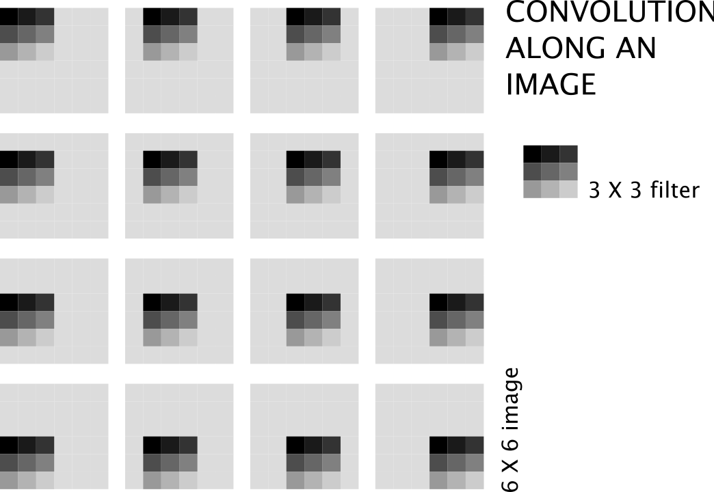
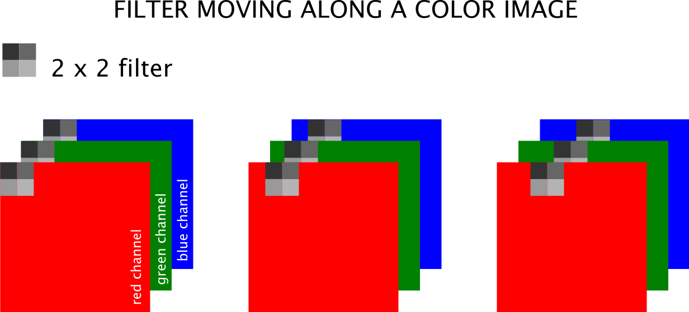
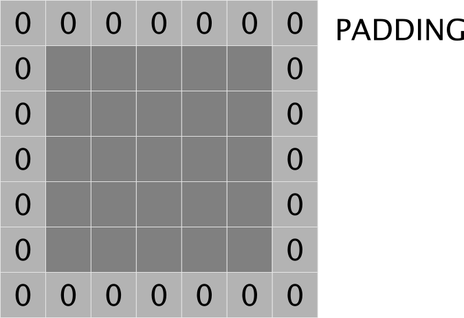

```{r setup, include=FALSE}
knitr::opts_chunk$set(echo = TRUE)
```

<style type="text/css">
h1 {
    color:#1a2451;
}
h2 {
    color:#ffbd4a;
}
h3 {
    color:#1a2451;
}
</style>


## Introduction

Many forms of data can be managed by densely connected neural networks.  In a previous chapter, images were transformed into vectors for input into a neural network.

Depending on the dimensions of images, these vectors can be very large.  This size can lead to parameter numbers that are simply to computationally expensive.  A small $100 \times 100$ pixel image transformed into an input vector already has $10000$ nodes.

Convolutional networks solve this problem through the use of the convolution operation.  This makes convolutional neural networks (CNN) ideal for image classification problems.

## Numerical representation of images

An image on a computer screen is made up of pixels (dots).  Each of these pixels, is merely a brightness level.  For a gray scale (black-and-white or monochrome) image these typically range from $0$ for no brightness (black) to $255$ for full brightness (white).

A gray scale image can therefor be represented as a rank-2 tensor (a matrix), with row and column numbers equal to the dimensions of height and width of the image.

A $5 \times 5$ gray scale image that is totally black is shown as a matrix in (1) below.

$$ \begin{bmatrix} 0 & 0 & 0 & 0 & 0 \\ 0 & 0 & 0 & 0 & 0 \\ 0 & 0 & 0  & 0 & 0 \\ 0 & 0 & 0  & 0 & 0 \\ 0 & 0 & 0  & 0 & 0 \end{bmatrix} \tag{1}  $$

Color images are made up of three such brightness value layers, one each for red, green, and blue.  This is represented numerically by a rank-3 tensor.  The three layers are referred to as _channels_.  The same black image above, when viewed as a color image, would have dimension of $5 \times 5 \times 3$.

## The convolution operation

The convolution operation forms the basis of a CNN.  The definition of the word convolution is _a thing that is complex and difficult to follow_.  Fortunately, the convolution operation is rather simple to understand.

Consider the two $3 \times 3$ matrices in (2) below.

$$  \begin{bmatrix} 1 & 2 & 3 \\ 4 & 3 & 3 \\ 3 & 4 & 2 \end{bmatrix} \begin{bmatrix} 3 & 3 & 2 \\ 1 & 1 & 2 \\ 7 & 2 & 2 \end{bmatrix} \tag{2}$$

The convolutional operation multiplies the corresponding values (by index or address) and adds all these products.  The result is shown in (3) below.

$$\left(1 \times 3\right) + \left(2 \times 3\right) + \left(3 \times 2\right) + \\ \left(4 \times 1\right) + \left(3 \times 1\right) + \left(3 \times 2\right) + \\ \left(3 \times 7\right) + \left(4 \times 2\right) + \left(2 \times 2\right) \\ = 3 + 6 + 6 +4 +3+6+21+8+4 \\ = 61\tag{3}$$

Note that this is not matrix multiplication, where a $3 \times 3$ matrix multiplied by a $3 \times 3$ matrix will results in a $3 \times 3$ matrix.

There is more to the convolution operation, though.  Images are usually larger than $3$ pixels wide and high.  Consider then a very small, square image that is $10$ pixels on either side.  The first $3 \times 3$ matrix in the example above is placed in the upper left corner of the image, so that a $3 \times 3$ area overlaps.  A similar multiplication and addition operation ensues, resulting in a scalar value.  This becomes the top-left pixel in the resultant _image_.  In this course the _resultant image_ will refer to the data for the next layer.  The $3 \times 3$ matrix now moves on one pixel to the tight of the image and the calculation is repeated, resulting in the second pixel value of the resultant image.  When the $3 \times 3$ matrix runs up against the right edge of the image and performs the same calculation, it then moves one pixel down and jumps all the way to the left.  This process continues until the $3 \times 3$ matrix ends up at the bottom right of the image.  This is the convolution operation and is depicted below.



Other than solving the problem of many nodes when using a densely connected neural network, the convolution operation has the ability to detect edges.  As more convolutional layers are added, the edges forms shapes, and eventually a representation of the original image than can be classified.

A video tutorial by this author using Microsoft Excel to explain the concept of the convolution operation, and how it detects edges, is available at https://www.youtube.com/watch?v=kgp58cLaFHs.

## The filter and resultant image

The $3 \times 3$ matrix in the example above is called a _kernel_ or a _filter_.  Filters of size $3 \times 3$ are commonly used.

The values in the kernel are akin to the weights in a densely connected neural network.  More than one filter can be (and is) used in a convolutional layer.  During many epochs their weight values update to discern the edges and shapes as discussed.

The resultant image is necessarily smaller than the original image (or the prior _image_), deeper in the network.  If the original image is square and of pixel size $n \times n$ and the kernel is of size $m \times m$, then moving along one pixel at a time will result in an image of the size given in equation (1).

$$\left( n - m +1 \right) \times \left( n - m + 1 \right)\tag{1}$$

If $p$ filters are used, the resultant _image_ is built up of a tensor of the dimension given in equation (2).

$$\left( n - m +1 \right) \times \left( n - m + 1 \right) \times p \tag{2}$$

When using color images with red, green, and blue channels, the kernel must similarly have a third axis over similar size, namely three.  The process is depicted below.



The original image of size $6 \times 6$ convolved with  a $3 \times 3$ filter (without padding and a stride length of $1$), produces a $4 \times 4$ resultant image as shown below.


## Padding

It follows from the description of the convolution operation above that pixels away from the edge are _more involved_ in the learning process.  To aid in the edge pixels contributing to the process and to prevent the resultant image from being smaller, _padding_ can be employed to the original image.  An edge of zero values are added all around the image.  Where it was $n \times n$ before, it becomes $\left( n + 2 \right) \times \left( n + 2 \right)$ in size.  Note that this is the specific case of a kernel with and odd size, i.e. $3 \times 3$.  Padding with zero-valued pixels is shown below.



## Stride

The process described so far, has the kernel moving along and down, one pixel at a time.  This is the _stride length_.  A higher value for the stride length can be set.  A stride length of two is shown below.


## Pooling

_Pooling_ consolidates the resultant image by looking at square sized pixel grids, i.e. $2 \times 2$.  This grid moves along the image as with the convolution operation.  Max pooling is most commonly used.  In the grid formed by a $2 \times 2$ square pixel area, the largest value is maintained in a new resultant image.

Average pooling, where the average of the values in the grid is calculated, can also be used.  It has not been shown to be of much benefit and was used prior to the current era of deep learning.

Max pooling for a $2 \times 2$ grid is shown below.  The maximum value in the first grid is $78$, which is the maximum value in the first pixel of the resultant image.  It remains the maximum value as the grid moves one pixel to the right, and so on.


## Flattening

Before an output layer can be constructed, the last resultant image must be flattened, i.e. turned into a vector.  Each pixel is simply taken from top-left, moving along the current row, before dropping down one row and restarting at the left until to bottom-right is reached.  This is then passed through a densely connected layer.

## Conclusion

The parameters that make up the filters _learn_ about the shapes, forms, and edges in the image.  Together with the final densely connected part, a CNN is well suited to classify images.