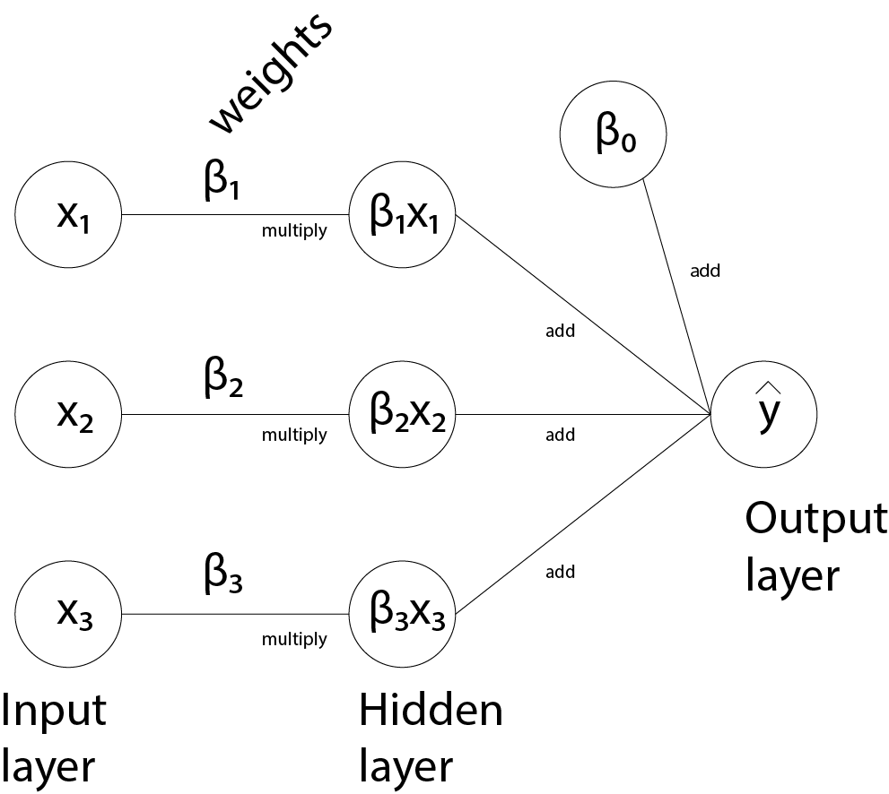
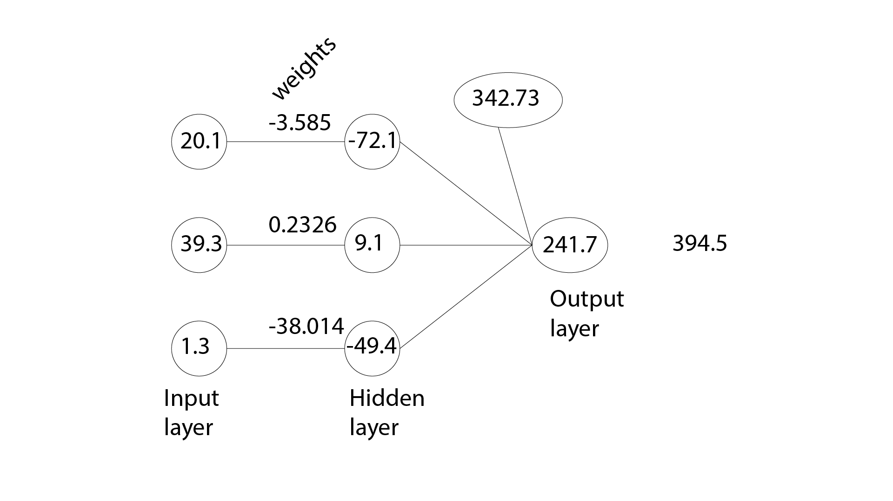

```{r setup, include=FALSE}
knitr::opts_chunk$set(echo = TRUE)
```

```{r}
library(readr)
library(tibble)
```


<style type="text/css">
h1 {
    color:#1a2451;
}
h2 {
    color:#ffbd4a;
}
h3 {
    color:#1a2451;
}
</style>


Watch the video series on YouTube at https://www.youtube.com/watch?v=9-QYsN_knG4&list=PLsu0TcgLDUiIKPMXu1k_rItoTV8xPe1cj  
Download the files at https://github.com/juanklopper/Deep-learning-using-R 

## Introduction

With the knowledge of the preceding chapters, it is time to view regression as a shallow network.  All the calculations remain exactly as before.  Conceptualizing the process as a neural network is the aim of this chapter.

## Multiple linear regression as a network

Whereas the previous chapter viewed only a single feature variable, the dataset below represents three feature variables, all of continuous numerical data type, and a target variable, similarly of continuous numerical data type.

```{r}
# Import a spreadsheet file
df <- read_csv("MultipleLinearRegression.csv")
df
```

Note that there are $10$ samples and $3$ feature variables, the aim is to calculate values for $\beta_0$, $\beta_1$, $\beta_2$, and $\beta_3$ that will minimize a specific cost function.

If each of the variable are seen as a column vector, expressed with underlines, $\underline{x}_1$, $\underline{x}_2$, and $\underline{x}_3$, the requirement is to find values such that the predicted target is as close to the ground-truth values in the column vector $\underline{y}$ as seen in equation (1).

$$\beta_0 + \beta_1 \underline{x}_1 + \beta_2 \underline{x}_2 + \beta_3 \underline{x}_3 \approx \underline{y} \tag{1}$$

As before, the loss function is calculated for every sample (row in the table above).  The notation changes to a superscript $\left( i \right)$ to indicate every sample and the loss function is given in equation (2).

$$L^{\left( i \right)} \left( \beta_0 , \beta_1 , \beta_2 , \beta_3  \right) = { \left( \beta_0 + \beta_1 x_1^{\left( i \right)} + \beta_2 x_2^{\left( i \right)} + \beta_3 x_3^{\left( i \right)} - y^{\left( i \right)} \right) }^{2} \tag{2}$$

The cost function will average all of the losses and finally the process of gradient descent will result in optimal values for $\beta_0$, $\beta_1$, $\beta_2$, and $\beta_3$.

Using the `lm()` function in `R` provides a quick and easy way of calculating the optimal values.

```{r}
model <- lm(y ~ x1 + x2 + x3,
            data = df)
summary(model)
```

The solution shows $\beta_0 = 342.7$, $\beta_1 = -3.6$, $\beta_2 = 0.2$, and $\beta_3 = -38.0$. (Note the poor Mutiple R-squared value and the high _p_ values.  The data was created randomly, so even the best values for all the $\beta$ parameters are still going to be a bit off the mark with their predicted values).

## Flow diagram

The above model can be represented as a flow-diagram.  This allows for the introduction of the concept of neurons called _perceptrons_ (more about this in upcoming chapters).

The diagram below expresses all of the calculations above.  The feature variables are turned on their sides (transposed) and represent the input state of the network.



Following this is a layer of three _neurons_.  The values that each of the three neurons, called _nodes_ take is the product of the corresponding input node and the associated parameter, called a _weight_.

The last layer is a single node and takes as input the sum of all the three previous nodes plus the value held in $\beta_0$, called the _bias node_.  This is the predicted or output value and will be compared to the target value.

And that it it!  A neural network (of sorts) with a single deep (hidden) layer.  This layer holds values that are different from the actual input values (actual feature variable values for each subject or row).

As before, all of the rows will pass through the _network_ and a cost function will be created, consisting of four unknowns, $\beta_0$, $\beta_1$, $\beta_2$, and $\beta_3$.

This whole process as described is known as _forward propagation_.  This is followed by the process of _backpropagation_.  This uses the process of gradient descent to update the values of $\beta_0$, $\beta_1$, $\beta_2$, and $\beta_3$.  These new values are then used in another forward propagation.  Each pair of forward propagation and backpropagation is known as an _epoch_.  

During the first forward pass, the values for $\beta_0$, $\beta_1$, $\beta_2$, and $\beta_3$, called the _weights_ are _initialized_.  This is the process of providing each of the weights with a random value allowing for the calculation of actual values for the hidden nodes and the output node.  Backpropagation through gradient descent then updates all of these values with (hopefully) better ones.  Below is a graph of the first row of data.



## Conclusion

The process of forward propagation and back propagation allows a neural network to _learn_ the optimal values of parameters such that the best possible prediction for a target variable can be made.

It is simply stated, a very, very elegant process, transforming the idea of learning into mathematical functions.

The important take-aways from this chapter are two-fold:

1. Defining new terms for old concepts, introduced in the preceding chapters, i.e. unknowns or parameters are called _weights_.
2. The idea of hidden layers consisting of nodes that hold the values from which the weights can be learned through numerous epochs.