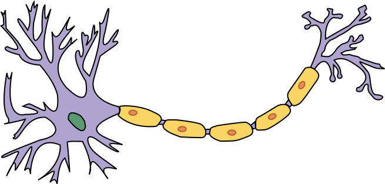
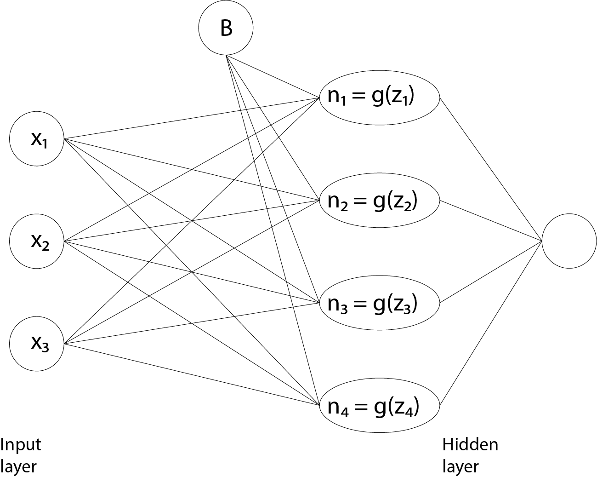

```{r setup, include=FALSE}
knitr::opts_chunk$set(echo = TRUE)
```

```{r}
suppressMessages(library(plotly))
suppressMessages(library(sigmoid))
```


<style type="text/css">
h1 {
    color:#1a2451;
}
h2 {
    color:#ffbd4a;
}
h3 {
    color:#1a2451;
}
</style>


## Introduction

This chapter introduces the basics of a proper neural network, more specifically, a densely connected single-layer neural network.

The preceding chapter already contained all the information required to readily grasp the creation of these networks.  The only new concept introduced here, will be the way in which the weights and the input feature variables are _connected_.

## The perceptorn

The idea of a deep neural network is loosely based on the structure and function of a neuron (a brain cell).  A schematic depiction of a neuron in shown below (By Dhp1080, svg adaptation by Actam - Image:Neuron.svg, CC BY-SA 3.0, https://commons.wikimedia.org/w/index.php?curid=4293768).



The neuron body accepts the transmission of impulses, which travels along the axon to terminal ends, each connecting with many other neurons via their dendrites.  The important analogy here is that there are many connections, unlike the examples shown with regression in the preceding chapters.  What is not so clear from this analogy, is that each neuron controls the _impulse_ that it transmits down the line.

## A densely-connected deep layer

The diagram below shows exactly how the single deep layer is connected to the input layer.  



The input layer consists of three feature variables and the single deep (hidden) layer consists of four nodes (neurons).  The number of nodes in the hidden layer is known as a _hyperparameter_.  This distinguishes it from the term _parameter_ that has been used up until now.  A hyperparameter is a value that the designer of a neural networks decides on.  A parameter is a value that the network learns (optimizes) through gradient descent.  The choice of four nodes is completely arbitrary in this instance.

Since there are three input nodes, each with four connections, there are a total of $3 \times 4 = 12$ weights.  These values will no longer be referred to by the symbol $\beta_i$.  Linear algebra is used in calculating the product between the input variables and the weights.

In equation (1) below, the three input variables values are depicted as a column vector, $\underline{x}$.  The $x_i, \quad i \in \left\{ 1,2,3 \right\}$ represent a row in a dataset, i.e. the data point values for the three feature variables for a specific subject.

$$\underline{x} = \begin{bmatrix} x_1 \\ x_2 \\ x_3 \end{bmatrix} \tag{1}$$

The resultant values in the hidden layer is represented in equation (2) as a $4 \times 1$ column vector, $\underline{z}$.

$$\underline{z} = \begin{bmatrix} z_1 \\ z_2 \\ z_3 \\ z_4 \end{bmatrix} \tag{2}$$

The twelve weight values can be represented as a rank-2 tensor (a matrix) with dimension $3 \times 4$, as shown in equation (3).

$$ W = \begin{bmatrix} w_{11} && w_{12} && w_{13} && w_{14} \\ w_{21} && w_{22} && w_{23} && w_{24} \\ w_{31} && w_{32} && w_{33} && w_{34} \end{bmatrix} \tag{3}$$

The product of the differently ranked tensors that will result in a $4 \times 1$ column vector is given in equation (4).  Note that it requires taking the transpose of the weight matrix, which turns the number of rows into $4$ and the number of columns into $3$.

$$W^T_{4 \times 3} \cdot \underline{x}_{3 \times 1} = \underline{n}_{4 \times 1} \tag{4}$$

A bias term can be added to this and is given in equation (5).

$$W^T_{4 \times 3} \cdot \underline{x}_{3 \times 1} + \underline{b}_{4 \times 1} = \underline{z}_{4 \times 1} \tag{5}$$

Note that to maintain dimensionality, the bias-vector must have a dimension of $4 \times 1$.

## The activation function

The final step in determining the actual value that each hidden node will have and pass to the output is an activation function.  The preceding chapter on logistic regression introduced the sigmoid function.  The most common activation function used today, though, is the rectified linear unit (ReLU) function.  It is depicted in the graph below.

```{r}
x = seq(-3, 3, 0.01)
y = relu(x)

p <- plot_ly(x = x,
             y = y,
             name = "ReLU function",
             type = "scatter",
             mode = "lines") %>% 
  layout(title = "ReLU function")

p
```

If the ReLU activation function is written as $g \left(z_i \right)$, then the output of the four hidden noes as given in equation (6).

$${\begin{bmatrix} n_1 \\ n_2 \\ n_3 \\ n_4 \end{bmatrix}}_{4 \times 1} = {g \left( \begin{bmatrix} z_1 \\ z_2 \\ z_3 \\ z_4 \end{bmatrix} \right)}_{4 \times 1} \tag{6}$$

For each value $n_i$, calculated above, the activation function will express a $0$ if the specific value is $0$ or less and the actual value if the specific value is more than $0$.

The aim of an activation function is to introduce non-linearity.  This is another departure from simple linear and logistic functions that expressed a straight line, or plane, or hyperplane (a linear function).  This allows a neural network to learn more complex solutions when optimizing for the values of the weights.

## The output layer

The output can be a single node.  It takes as input the sum of the values held in each node $n_1$ (after applying the activation function).  If the problem was initially a binary classification problem, then this layer will hold a sigmoid activation function.

## Conclusion

A single hidden layer neural network is very similar in concept to linear and logistic regression models.  The differences lie in the dense connections formed between the input and hidden layer nodes and the activation applied to each value in the hidden layer.